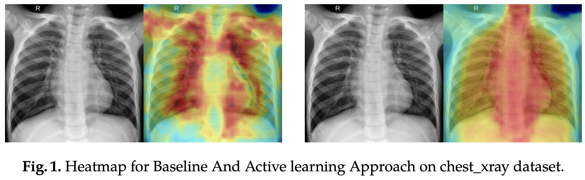
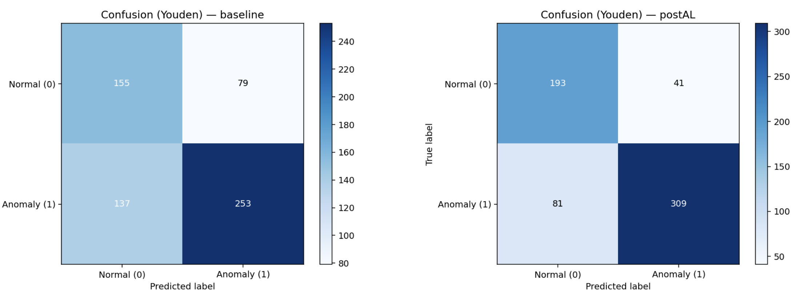

# I Detect What I Don’t Know: Incremental Learning with SWAG for Unknown Anomaly Detection

> **Abstract:** *Anomaly detection plays a critical role in medical imaging applications such as COVID-19 and pneumonia screening. However, most existing techniques depend on labeled anomalous samples, which are often scarce or impractical to obtain. We propose an unsupervised anomaly detection framework that integrates active learning with a pre-trained models to improve detection without requiring anomalous training data. The pretrained model are less computationally expensive to train and experimental results on the COVID CXR and chest_xray datasets. COVID CXR shows that active learning substantially enhances performance, raising ROC-AUC from 0.9489 (baseline) to 0.9982 and F1 from 0.8048 to 0.9746, while reducing false positives from 34 to 5. Similarly, on the chest_xray pneumonia dataset, our method improves ROC-AUC from 0.6834 to 0.8960 and F1 from 0.7008 to 0.8351, with notable gains in precision (0.7620 to 0.8829). These results demonstrate that active learning can substantially refine anomaly detection accuracy in medical imaging tasks, even when anomalous samples are unavailable during training.* 

## Results
### Chest-Xray-Pneumonia
The proposed incremental learning  framework substantially improves performance across multiple metrics. ROC-AUC increases from 0.6834 (baseline) to 0.8960, while PR-AUC improves from 0.7656 to 0.9366. Accuracy also rises from 0.6538 to 0.8045. Precision improves from 0.7620 to 0.8829, with recall increasing from 0.6487 to 0.7923, resulting in an F1 gain from 0.7008 to 0.8351. In addition to these improvements, false positives are reduced from 79 to 41, while true positives increase from 253 to 309. 
The dataset is available at {https://www.kaggle.com/datasets/paultimothymooney/chest-xray-pneumonia/}.
### COVID CXR Dataset
 Our incremental learning method yields significant gains over the baseline. ROC AUC improves from 0.9489 to 0.9982, and PR AUC rises from 0.8976 to 0.9951. At the Youden-optimal threshold, accuracy increases from 0.8868 to 0.9861. Precision improves from 0.7481 to 0.9583, recall from 0.8707 to 0.9914, and F1 score from 0.8048 to 0.9746. In terms of confusion matrix entries, true negatives increase (283 to 312), false positives decrease (34 to 5), false negatives are reduced (15 to 1), and true positives rise (101 to 115).

## Acknowledgement
We thanks to PatchCore implementaions.

